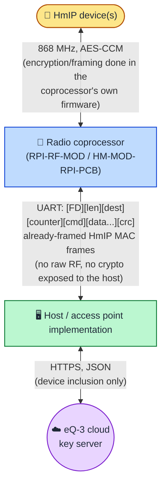

# HomematicIP Serial & Keyserver Protocol Specification

An independent, community reverse-engineering reference for the HomematicIP
(HmIP) radio protocol as spoken between a host system and a UART-attached
HmIP radio coprocessor module (e.g. RPI-RF-MOD / HM-MOD-RPI-PCB), and for
the cloud key-exchange step that module-based access points use during
device pairing.

## What this covers

HmIP devices communicate over a proprietary 868 MHz radio protocol with
AES-CCM-style encryption. The encryption and RF framing themselves happen
inside the radio coprocessor module's own firmware — a host talking to that
module never sees raw RF bytes, only a higher-level framed protocol over a
UART link. This repository documents:

*(New to this topic? `docs/index.md` has a suggested reading order and a
per-file confidence summary.)*

- the **serial/UART command envelope** between a host and the coprocessor
  module (`docs/serial-protocol.md`);
- the **MAC and Application frame formats** carried inside that envelope —
  the actual HmIP protocol data unit structure (`docs/mac-application-frames.md`);
- **security modes, device inclusion (pairing), and the cloud key-exchange
  service** a HomematicIP access point uses to obtain per-device encryption
  keys (`docs/security-and-inclusion.md`);
- **native device-to-device links** ("Verknüpfungen") — the mechanism by
  which, for example, a window sensor tells a thermostat a window is open
  without any server being involved at runtime (`docs/native-device-links.md`);
- the **configuration frame family** used to read and write per-device
  settings such as sample intervals, calibration offsets, and weekly heating
  programs (`docs/configuration-frames.md`);
- **device-type identification** — how to map the numeric manufacturer/device-type
  fields carried in an Inclusion Request frame to a real model name
  (`docs/device-catalog.md`);
- a **glossary** of protocol-specific terms and acronyms used throughout
  this specification (`docs/glossary.md`);
- a **worked walkthrough** of a device inclusion handshake through to
  ordinary post-inclusion traffic — structural for the handshake itself,
  byte-by-byte for the real captured example once ordinary traffic begins
  (`docs/walkthrough.md`);
- an honest list of what remains unconfirmed (`docs/known-gaps.md`).

## Architecture at a glance

The coprocessor is a "dumb" framing/crypto engine: it hands the host
already-decrypted MAC frames for received traffic, and expects fully-formed
MAC frames to transmit — it does not interpret their contents. All
application-layer meaning (what a frame's payload means, how to answer it,
how to pair a new device) is the host implementation's responsibility, the
same way it is for a real access point's own server-side software.

## Status

This is an ongoing, independent reverse-engineering effort. Facts below are
individually marked:

- **Verified on the wire** — observed directly in real traffic between a
  real coprocessor module and either a from-scratch reimplementation or a
  stock vendor access-point software stack running against the same
  hardware.
- **Derived from source analysis** — not yet observed on the wire; inferred
  from cross-referencing publicly available decompiled analysis of the
  vendor's own server-side software (see Legal notice below) or from
  publicly documented conventions of the wider HomeMatic product family.
  Treat these as working hypotheses pending live confirmation.

Most of the serial/MAC-layer material is wire-verified. The security and
keyserver material is a mix — see `docs/security-and-inclusion.md` for the
exact boundary. See `docs/known-gaps.md` for a consolidated list of open
questions; verification help from anyone with access to real hardware is
welcome.

## Legal Notice & Interoperability

This specification is an independent community research effort created solely for the purpose of achieving **software interoperability** with independently created programs and hardware integrations.

The information contained herein was gathered through:

1. **Clean-room behavioral observation** of genuine hardware and network traffic — including real HmIP radio coprocessor modules, end devices, and (where noted) the public eQ-3 cloud key-exchange API.
2. **Analysis for interoperability purposes** strictly within the framework of Article 6 of EU Directive 2009/24/EC (on the legal protection of computer programs) and its national implementations (e.g., § 69e of the German Copyright Act, UrhG).

**No proprietary binaries, vendor source code, or decompiled artifacts are reproduced, hosted, or distributed in this repository.** This repository contains only factual protocol specifications, field layouts, state machines, and byte-level definitions expressed in the contributors' own original words and notation.

This project is non-commercial, independent, and unaffiliated with, sponsored by, or endorsed by eQ-3 AG. *Homematic IP® is a registered trademark of eQ-3 AG.*

## License

- **Documentation & Specifications:** [CC BY-NC-SA 4.0](LICENSE) (Attribution-NonCommercial-ShareAlike 4.0 International)
- **Code Snippets & Pseudocode:** Dual-licensed under [MIT License](https://opensource.org/licenses/MIT) or [CC0 1.0 Universal / Public Domain](https://creativecommons.org/publicdomain/zero/1.0/)
