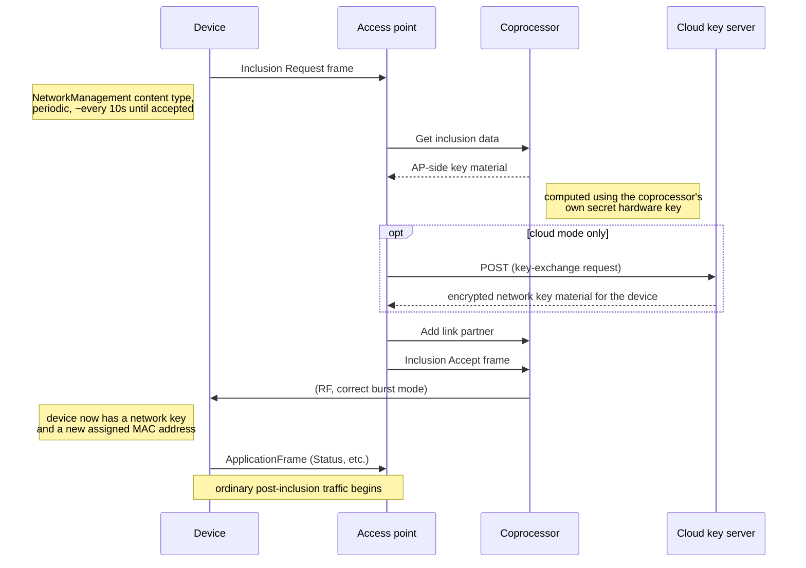

# Security modes, device inclusion, and the cloud key exchange

Confidence varies significantly by section — each is marked individually.
This is the least-settled area of this specification; see
`known-gaps.md` for a consolidated list of what still needs live
confirmation.

## MAC security modes

See `mac-application-frames.md` for the header-level bit layout
(SecurityControl values 0/1/2). In practice, an access point flags
essentially every frame it sends to an already-included device as
security-ENABLED, but relies on the coprocessor module to compute and
insert the real per-frame message integrity code — the host-side logical
frame construction never handles real key material for ordinary
application traffic. **Verified on the wire.**

Frames exchanged during the inclusion handshake itself (below) are sent
with security disabled at the MAC layer — the security material being
exchanged is carried as explicit payload fields, not via MAC-layer
encryption, since the device and access point do not yet share a network
key at that point.

## Device inclusion handshake

**Verified on the wire, field layouts derived from source analysis of
vendor server software.** Overview of the message flow between a joining
device and an access point implementation:



### Inclusion Request frame (device → access point)

NetworkManagement content type, a dedicated frame-type byte, payload
(39 bytes, or 42 if a "pairing accepted" flag is set):

| Field | Size | Notes |
|---|---|---|
| SGTIN (device identifier) | 12 bytes | |
| Manufacturer code | 2 bytes | |
| Manufacturer device type | 4 bytes | |
| Firmware version + test-status flag | 3 bytes, packed | bit 23 = test-status-not-OK, bits 0–22 = firmware version |
| Device role/mode flags | 2 bytes, packed | access-controller / router / portable-device / listener-mode bits; pairing-accepted / default-key / local-key / master-key-inclusion-accepted bits |
| Nonce (joining device's) | 4 bytes | |
| MIC (joining device's, master-key-based) | 4 bytes | |
| Joining-device one-time-key contribution | 8 bytes | |
| (optional) channel A, channel B, peer count | 1+1+1 bytes | present only when the "pairing accepted" flag is set |

The device re-sends this frame periodically (observed roughly every 10
seconds) until it receives a valid accept.

**Worked example, verified on the wire** — a real captured Inclusion
Request (as the payload of a serial Received event command; RSSI byte
`0x32` precedes the MAC frame, out-of-band, see `mac-application-frames.md`):

```
01 00 8f  1dd03b  f00003  10  3014f711a00000dd898cxxxx  0001 00000102 01120a 0403  4ec4482f f934de46 fb0cd5d2588b48e7
```

*(SGTIN's last 4 hex digits redacted throughout this document — it's a
real, physical device's serial-number-equivalent identifier; every other
byte here is unaffected.)*

- `01 00 8f` — MAC header: `ContentType`=1 (NetworkManagement), `SecurityControl`=0 (disabled, as expected pre-inclusion); `HomematicIPVersion`=8, `LocalHopLimit`=7.
- `1dd03b` — MAC source address: the joining device's own temporary/broadcast-scheme address.
- `f00003` — MAC destination address: the well-known broadcast address a joining device sends its Inclusion Request to.
- `10` — the NetworkManagement content type's own dedicated frame-type byte (Inclusion Request).
- `3014f711a00000dd898cxxxx` — SGTIN (12 bytes, last 2 bytes redacted).
- `0001` — manufacturer code = 1.
- `00000102` — manufacturer device type = 258. Both values match [`device-catalog.md`](device-catalog.md)'s verified-table entry for `HMIP-SWDO`, independently cross-checked here from a completely different real capture.
- `01120a` — packed firmware version + test-status flag.
- `0403` — packed device role/mode flags (includes the declared listener mode).
- `4ec4482f` — the device's own nonce.
- `f934de46` — the device's own MIC (master-key-based).
- `fb0cd5d2588b48e7` — the device's one-time-key contribution.

All 39 body bytes are accounted for exactly against the field table
above — no "pairing accepted" optional trailer present, as expected for
a first-time inclusion.

### Access-point-side key material (Get inclusion data)

The access point asks its own coprocessor module (serial command 17, see
`serial-protocol.md`) for a block of key-exchange material specific to
this inclusion attempt. **This is not a passthrough of anything the
device sent** — it is computed by the coprocessor using its own secret,
per-module hardware key (an AP master key never exposed to the host
software), combined with the request's SGTIN and nonce, and a freshly
generated random one-time-key contribution and nonce on the access-point
side.

**Confidence note:** the exact algorithm used here (a CCM*-style
CBC-MAC/AES-128 construction — see below) is derived from source analysis
of vendor server software, cross-referenced against the coprocessor's
observed real responses, and is understood well enough to have produced
inclusion attempts the real cloud key server accepted as validly formed
(see below) — but a fully successful end-to-end inclusion using
locally-computed key material alone (without going through the cloud
step) has not been independently confirmed against a real device.

**Underlying cryptographic primitives** (standard, not vendor-specific):
plain NIST FIPS-197 AES-128 as the block cipher. On top of that, a
CCM*-style construction:
- A symmetric CTR-style keystream: `keystream_block(i) = AES_encrypt(key,
  0x01 || nonce(13 bytes) || big_endian_u16(i+1))`, XORed with the i-th
  16-byte block of the data being encrypted/decrypted (same operation
  encrypts or decrypts).
- A CBC-MAC-based MIC: a B0 flag byte (value depends on MIC length — 4 or
  8 bytes — and whether additional authenticated data is present),
  followed by the 13-byte nonce and a big-endian length field, forms the
  first CBC-MAC block; the message (plus optional AAD, each padded to a
  16-byte boundary) follows; the raw CBC-MAC output is then masked by
  XORing with a separate "S0" keystream block (`AES_encrypt(key, 0x01 ||
  nonce || 0x0000)`).
- The 13-byte nonce used for the network-key exchange step specifically
  is derived from 9 bytes of the device's SGTIN plus a 4-byte one-time
  value (nonce or one-time-key half, depending on which exchange step).

**Worked example, verified on the wire** — a real Get inclusion data
request/response pair for the same inclusion attempt as the Inclusion
Request example above, correlated by the serial envelope's sequence
counter:

```
request:  3014f711a00000dd898cxxxx 4ec4482f fb0cd5d2588b48e7
response: 01  8f6c7d6e9719a67c3702a8fbd16a080587ccf8abcab5b1329218a2db5d447ec460382ec3
```

- The **request** is exactly 24 bytes: the joining device's own SGTIN (12
  bytes) + nonce (4 bytes) + one-time-key contribution (8 bytes) — the
  subset of the Inclusion Request frame's own fields the coprocessor
  needs to derive this inclusion attempt's key material, echoed straight
  back to it.
- The **response** arrives via the generic Response serial command (6),
  correlated by the same sequence counter — **not** by echoing the
  triggering command's own number back. Its first byte is the ordinary
  Response status code (`01` = OK, see `serial-protocol.md`'s Response
  codes table); the remaining 36 bytes are the coprocessor's computed
  key-exchange material. This spec does not decode that 36-byte payload's
  own internal field boundaries — it's produced by the coprocessor's
  secret-key computation and, in the cloud-keyserver path, is forwarded
  onward largely as opaque bytes (see "Cloud key exchange" below) rather
  than interpreted by the host.

(This same real capture also shows the host issuing serial command 20
— "set encrypted network key" per `serial-protocol.md`'s command table —
with a real 66-byte payload, at a point between this step and the
Inclusion Accept frame below. This specification doesn't yet have a
confirmed field-level breakdown of that payload; noted here only as an
observed, real part of the sequence — see `known-gaps.md`.)

**Keystream generation** (the CTR-style construction described above, as
pseudocode — `aes128_encrypt(key, block)` is the one external primitive
this depends on, a plain single-block AES-128-ECB encryption of exactly
16 bytes):

```
function keystream_block(key, nonce_13_bytes, block_index_from_1) -> 16 bytes:
    counter_block = [0x01] + nonce_13_bytes + big_endian_u16(block_index_from_1)
    return aes128_encrypt(key, counter_block)

function encrypt_or_decrypt(key, data, nonce_13_bytes) -> bytes:
    # symmetric: the same function encrypts and decrypts
    output = []
    for i, offset in enumerate(range(0, length(data), 16)):
        ks = keystream_block(key, nonce_13_bytes, i + 1)   # blocks are 1-indexed
        block = data[offset : offset + 16]                  # last block may be shorter than 16
        output += xor(block, ks[0 : length(block)])
    return bytes(output)
```

**CBC-MAC / MIC calculation:**

```
function b0_flag_byte(mic_length, has_aad) -> u8:
    # These match the standard CCM*/RFC 3610 B0 flag-byte formula exactly —
    # (has_aad << 6) | (((mic_length - 2) / 2) << 3) | (L - 1) — given the
    # length-field size L this protocol uses, L=2: a 13-byte nonce plus a
    # 2-byte length field fills exactly the 16-byte B0 block (1 flag byte +
    # 13 + 2). Not a protocol-specific deviation, just the standard formula
    # with this protocol's own field-size choices plugged in; the two MIC
    # lengths this protocol uses are 4 and 8 bytes.
    if mic_length == 4: return 73 if has_aad else 9
    if mic_length == 8: return 89 if has_aad else 25

function pad_to_16(data) -> bytes:
    remainder = length(data) mod 16
    if remainder == 0: return data
    return data + zero_bytes(16 - remainder)

function calculate_mic(key, message, nonce_13_bytes, mic_length, authentication_data = null) -> bytes:
    b0 = [b0_flag_byte(mic_length, authentication_data is not null)] + nonce_13_bytes + big_endian_u16(length(message))

    to_authenticate = []
    if authentication_data is not null:
        to_authenticate += pad_to_16(big_endian_u16(length(authentication_data)) + authentication_data)
    to_authenticate += pad_to_16(message)

    state = aes128_encrypt(key, b0)                          # first CBC-MAC block
    for offset in range(0, length(to_authenticate), 16):
        block = to_authenticate[offset : offset + 16]
        state = aes128_encrypt(key, xor(state, block))
    raw_mic = state[0 : mic_length]

    s0 = aes128_encrypt(key, [0x01] + nonce_13_bytes + [0x00, 0x00])   # masking block, block index 0
    return xor(raw_mic, s0[0 : mic_length])
```

### Inclusion Accept frame (access point → device)

NetworkManagement content type, dedicated frame-type byte, fixed 44-byte
payload:

| Field | Size |
|---|---|
| Used inclusion mode | 1 byte |
| NonceKS | 4 bytes |
| One-time-key MIC | 4 bytes |
| One-time key | 8 bytes |
| Encrypted network key | 16 bytes |
| New device address | 3 bytes |
| New MAC sequence number | 4 bytes, big-endian |
| Network key MIC | 4 bytes |

**Wire delivery, verified:** this accept frame is sent to the device as an
ordinary Send protocol frame serial command (3) — i.e. the generic,
verbatim frame-relay path, not the more structured "send inclusion accept
with explicit fields" serial command (24). That structured command is
used only by a separate, device-local-key inclusion path (a device whose
per-device key is pre-provisioned out of band, printed on its packaging)
— not the default retail master-key / cloud-keyserver path this document
otherwise describes. **Critically, the accept frame must be prefixed with
the correct burst mode byte** (see `serial-protocol.md`) derived from the
*joining device's own declared listener mode* (from its inclusion
request) — sending it as a single non-repeated transmission to a
cyclic/burst-listening device (the common case for battery-powered
sensors and thermostats) can silently fail to reach the device at all,
with no error on the access-point side. This was directly observed as the
root cause of inclusion attempts that appeared correct in every other
respect (correct crypto, correct frame layout, correctly preceded by an
Add link partner registration) but never completed — the device's status
indicator went from "pairing" directly to "failed" instead of "included".

**Before sending the accept, the access point must register the new
device as a link partner with its own coprocessor** — serial command 4
(Add link partner, see `serial-protocol.md`) with the new device address,
an operation mode, and a router address (all-zero for a direct,
non-routed device) — sent once, immediately before the accept frame.

**Worked example, verified on the wire** — the real Add link partner
call and Inclusion Accept frame that completed the same inclusion
attempt as the two worked examples above:

```
Add link partner (serial command 4): 5f1540 04 000000

Inclusion Accept frame:
01 00 8e  b185ad  1dd03b  20  01  37bffffb  39af7dd5  98ae3b78d620afaf  2d3bbaff3029ae73e0367d01361e72c3  5f1540  000007e2  e34ac4ea
```

Add link partner: `5f1540` — the new device address (matches the
accept frame's own "New device address" field below); `04` — operation
mode; `000000` — router address (all-zero, direct/non-routed).

Inclusion Accept frame:

- `01 00 8e` — MAC header, `ContentType`=1, `SecurityControl`=0 (still unsecured — no network key shared yet).
- `b185ad` — MAC source address: the access point.
- `1dd03b` — MAC destination address: the joining device's own address from its Inclusion Request.
- `20` — the NetworkManagement content type's own dedicated frame-type byte (Inclusion Accept — distinct from the Inclusion Request's `0x10`).
- `01` — used inclusion mode.
- `37bffffb` — NonceKS.
- `39af7dd5` — one-time-key MIC.
- `98ae3b78d620afaf` — one-time key.
- `2d3bbaff3029ae73e0367d01361e72c3` — encrypted network key.
- `5f1540` — new device address.
- `000007e2` — new MAC sequence number (big-endian) = 2018.
- `e34ac4ea` — network key MIC.

All 44 body bytes are accounted for exactly against the field table
above, and the "new device address" here (`5f1540`) matches both the
preceding Add link partner call and every later frame this same device
sends for the rest of that capture session (including the real
Configuration-write example in `configuration-frames.md`) — a fully
self-consistent real sequence end to end. (This is a separate capture
session from `mac-application-frames.md`'s own worked Status-frame
example — different access point address, different device.)

### Post-acceptance

Once the device accepts inclusion, it stops re-sending its inclusion
request and begins sending ordinary Application-layer frames (status
updates, etc.) — see `mac-application-frames.md`.

## Cloud key exchange

**Verified on the wire.** The request format has been used against the
real production service and produces a genuine successful key-exchange
response — an explicit rejection (`{"notAnswerable": "true"}`) was seen
first, on early attempts that used a placeholder value in place of one
input the coprocessor itself must supply (see below); once that input
came from the real coprocessor module's own hardware-key computation
instead, the same request format succeeded.

For devices whose per-device key was never provisioned out of band (the
common case for a retail device with no local key sticker available), an
access point contacts eQ-3's cloud key server instead of resolving the
exchange purely locally:

- **Endpoint:** `HTTPS POST https://secgtw.homematic.com:8443/ccm/gateway`
- **Authentication:** none at the HTTP layer — a raw JSON body, no
  authorization header of any kind. The service instead validates the
  access point's identity implicitly, via the AP's SGTIN and the
  cryptographic material in the request itself.
- **Request body** (JSON, all binary fields as uppercase hexadecimal, no
  separators):

  ```json
  {
    "protocolVersion": 1,
    "accessPointID": "<access point SGTIN, hex>",
    "accessPointNonce": "<hex>",
    "joiningDeviceID": "<joining device SGTIN, hex>",
    "joiningDeviceNonce": "<hex>",
    "joiningDeviceMIC": "<hex>",
    "networkKeyEncrypted": "<hex>",
    "networkKeyMIC": "<hex>",
    "joiningDeviceFirmwareVersion": <integer>
  }
  ```

  `accessPointNonce`, `networkKeyEncrypted`, and `networkKeyMIC` are
  exactly the values the access point would otherwise compute entirely
  locally for a fully offline inclusion (see the Get inclusion data
  section above) — the cloud step does not change how these are produced,
  only what happens with the result afterward.

- **`accessPointID` must be a real, eQ-3-registered access point
  identity.** An access point implementation should determine this from
  its own coprocessor module's genuine hardware identity (its real SGTIN,
  stable across reboots) rather than any value a client of the
  implementation might otherwise supply, since presenting an identity you
  are not authorized to use is both a protocol violation and likely
  against the key server's terms of service.

- **Success response** (JSON), **verified on the wire** — the real
  production service returns this shape and these values are accepted
  by a real joining device when carried into the
  Inclusion Accept frame below:

  ```json
  { "jdEncNWK": "<hex>", "jdEncNWKMIC": "<hex>", "nonceKS": "<hex>" }
  ```

  These three values map directly onto the corresponding fields of the
  Inclusion Accept frame above (`jdEncNWK` → encrypted network key,
  `jdEncNWKMIC` → network key MIC, `nonceKS` → NonceKS) — no further
  cryptographic processing is needed on the access point's side once a
  successful response is received.

- **Error response:** `{ "error": "<message>" }`, or a specific observed
  rejection: `{ "notAnswerable": "true" }`. **Root cause identified and
  resolved.** This rejection occurs when `networkKeyEncrypted`/
  `networkKeyMIC` in the request were computed with a placeholder key
  instead of the coprocessor module's own real, secret hardware key —
  a mistake worth calling out explicitly, since a superficially
  reasonable placeholder (all-same-byte, matching a value some vendor
  server-side code paths use for a scenario with no real hardware
  attached) produces a request the service accepts and processes, but
  silently rejects at this final step, which can read as an identity or
  account problem when it is not. Once those two fields are computed
  using the real coprocessor's own on-device AES-CCM computation (see
  Get inclusion data above), the same request succeeds.

## Local-only key exchange mode

**Derived from source analysis; not independently verified against a real
device end-to-end.** As an alternative to the cloud step, an access point
may resolve the key exchange entirely offline, given a locally-configured
network key and a pre-provisioned per-device key (printed on the device's
packaging, not the device itself, for retail devices) looked up by SGTIN.
The cryptographic construction is the same CCM*-style scheme described
above; only the source of the per-device key differs (a local lookup table
vs. the cloud service resolving it). This mode has no external network
dependency at all once configured.

## Device removal (exclusion)

**Verified on the wire — two independent real captures, byte-identical in
shape**, of an access point removing an already-included `HmIP-SWDO` (the
mirror operation to inclusion above, triggered by the real vendor
software's own device-delete API, not by a device-side factory reset).

Unlike inclusion, this device is a
[sleeping/event-listener](native-device-links.md#sleeping-devices--the-real-constraint)
device — the removal command sits queued on the access point (a real,
repeatedly-observed `"Transmission is pending"` condition) until the
device transmits something of its own and briefly opens a receive window;
only then does the exchange below actually go out.

Three frames, in order:

1. **A HmIP Network Management frame, frame-type byte `f0`**, sent to the
   device — a new value in the same field documented for Inclusion Request
   (`0x01`) and Inclusion Accept (`0x20`) above, i.e. this spec now has
   three confirmed NetworkManagement sub-frame-types. Sent with
   `SecurityControl=ENABLED` (the device already has a network key from
   its own inclusion; the access point omits the SecurityNumber/
   IntegrityCode fields on the wire here too, same "coprocessor inserts
   the real MIC" behavior already established in
   [`mac-application-frames.md`](mac-application-frames.md#mac-header)).
   The device answers with its own NetworkManagement-type frame
   (acknowledging receipt).
2. **A second Network Management frame, frame-type byte `f2`**, same
   device, same security handling — answered with a plain serial-level
   Response (status `01`, OK), not a further device-originated frame.
3. **Remove link partner** (serial command 5, already documented in
   `serial-protocol.md` as `[device address: 3 bytes]`) — issued for the
   device's own current-session short address, removing it from the
   coprocessor's own hardware link-partner table. This is the same serial
   command already confirmed for
   [ordinary link removal](native-device-links.md#worked-example-verified-on-the-wire--real-link-removal);
   here it's the access point cleaning up the device's *own* entry (every
   HmIP device is also its own implicit link partner of the coprocessor)
   rather than a cross-device link.

Real worked example (capture #4; the device's own session address this
capture was `7bcb0a`):

```
AP -> device:  f0            (fd 00 0e 02 22 03 00 11 00 8e bdba0a 7bcb0a f0 …)
device -> AP:  (NetworkManagement-type acknowledgement)
AP -> device:  f2            (fd 00 0e 02 23 03 00 11 00 8e bdba0a 7bcb0a f2 …)
AP -> coprocessor:  Remove link partner  7bcb0a
                    (fd 00 06 02 24 05 7bcb0a …)
```

A second, fully independent capture (a different session, different
device short address `5a1046`, using the real vendor device-delete API
again from a clean state — no pending backlog from an earlier failed
call) reproduced the identical three-frame shape (`f0`, then `f2`, then
`Remove link partner` for that capture's own address) — the same
frame-type bytes in the same order both times is real, repeatable
evidence, not a one-off coincidence.

**Not confirmed**: what either `f0` or `f2` frame's payload beyond the
single frame-type byte contains (both were captured as exactly one byte
of NetworkManagement payload in both captures — it's possible one or both
genuinely carry no further payload, or this spec is missing trailing
bytes that were present but not distinguishable from the frame's own
security/checksum trailer); whether a *non-sleeping* device (a
mains-powered channel, e.g. a receiver relay) goes through the same
`f0`/`f2` sequence immediately rather than queuing; and whether removing
a device that's still a member of a native link (window-sensor or
heating-group) also tears down those links automatically or leaves them
dangling (see `known-gaps.md`'s existing note on heating-group link
removal, which this capture doesn't touch — the removed device here had
no active links at removal time).
